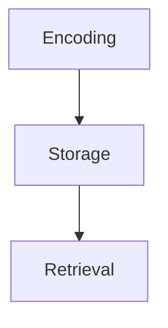
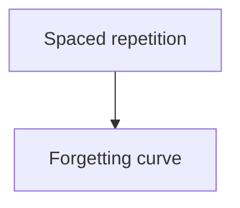

# Obsidian syntax reference

## Contents

- [Text formatting](#text-formatting)
- [Paragraphs and line breaks](#paragraphs-and-line-breaks)
- [Lists and tasks](#lists-and-tasks)
- [Links, embeds, block IDs](#links-embeds-block-ids)
- [Tags](#tags)
- [Code](#code)
- [Tables](#tables)
- [Mermaid diagrams](#mermaid-diagrams)
- [Math](#math)
- [Footnotes and comments](#footnotes-and-comments)
- [Escaping](#escaping)

## Text formatting

| Style | Syntax |
|---|---|
| Bold | `**text**` or `__text__` |
| Italic | `*text*` or `_text_` |
| Bold + italic | `***text***` |
| Strikethrough | `~~text~~` |
| Highlight | `==text==` (Obsidian extension) |
| Inline code | `` `text` `` |

Nest with different markers to stay readable: `**bold with _nested italic_**`.

## Paragraphs and line breaks

A blank line separates paragraphs. Consecutive blank lines collapse into one — extra newlines do not create extra spacing.

A single newline is a *soft* break: by default Obsidian shows it as a new line in the editor but joins it into the same paragraph in reading view. For a hard break inside a paragraph, end the line with **two trailing spaces**.

Headings use one to six `#`, and feed the Outline view and heading links:

```md
## Heading 2
### Heading 3
```

Horizontal rule: `---` on its own line (three or more `-`, `*`, or `_`).

## Lists and tasks

```md
- Unordered item
  - Nested item
1. Ordered item
2. Second item

- [ ] Open task
- [x] Completed task
- [-] Dropped task
- [?] Uncertain
```

Any character between the brackets is a valid state; `x` is complete and themes/plugins style the rest. Indent to nest, and list types can be mixed at different levels.

## Links, embeds, block IDs

```md
[[Note name]]
[[Note name|display text]]
[[Note name#Heading]]
[[Note name#Heading#Subheading]]
[[Note name#^block-id]]
[[#Heading in this note]]
[[#^block-in-this-note]]

![[Note name]]              embed whole note
![[Note name#Heading]]      embed a section
![[image.png]]              embed image
![[image.png|300]]          embed image at 300px wide
![[doc.pdf#page=3]]         embed a PDF page

[Text](https://example.com)                     external
         external image, 200px wide
```

**Block IDs** make a specific paragraph, list item, or quote linkable. Put `^an-id` at the end of the paragraph, or on its own line immediately after a list or blockquote:

```md
Retrieval practice beats rereading in every controlled comparison. ^retrieval-core
```

IDs allow letters, numbers, and hyphens. Block references work only inside Obsidian.

Markdown-style internal links are the alternative format if the vault has wikilinks disabled: `[Note name](Note%20name.md)` — spaces become `%20`, or wrap the target in angle brackets.

## Tags

Inline tags use `#`, frontmatter tags don't. Nested tags use `/`:

```md
#project/alpha #status/active
```

Tags can't contain spaces; use `-` or `_`. A tag that is only digits isn't valid — `#2026` needs to be `#y2026`. Tags inside code blocks or inline code aren't indexed.

Prefer a shallow, reusable taxonomy over one-off tags: tags are for cross-cutting filters, links are for relationships.

## Code

Inline: `` `code` ``. If the code contains a backtick, wrap in double backticks: ``` ``code with ` inside`` ```.

Fenced blocks with a language for highlighting (Obsidian uses Prism):

````md
```python
def review(card, grade):
    return card.interval * (2.5 if grade > 3 else 0.5)
```
````

To show a code block inside a code block, the outer fence needs **more** backticks than the inner one (four outside, three inside), or use `~~~` for one of them.

## Tables

```md
| First name | Last name |
| ---------- | --------- |
| Max        | Planck    |
| Marie      | Curie     |
```

Outer pipes are optional but worth keeping. Alignment comes from colons in the separator row:

```md
| Left | Center | Right |
| :--- | :----: | ----: |
| a    | b      | c     |
```

**Escape pipes inside cells.** A wikilink alias or an image size uses `|`, which would otherwise split the column:

```md
| Concept | Image |
| ------- | ----- |
| [[Spaced repetition\|SRS]] | ![[curve.png\|120]] |
```

Cells don't need to be aligned in the source, and the separator row needs at least two hyphens per column. Tables don't support multi-line cells — use `<br>` or move the content out of the table.

## Mermaid diagrams

````md

````

To make nodes link to notes, attach the `internal-link` class:

````md

````

Node names with special characters must be quoted. Links created this way don't appear in Graph view, so if the relationship matters, also state it in prose or a `## Related` list.

## Math

MathJax with LaTeX notation. Inline with single `$`, block with double `$$`:

```md
Retention after $t$ days is $R = e^{-t/S}$.

$$
\begin{vmatrix} a & b \\ c & d \end{vmatrix} = ad - bc
$$
```

Put the `$$` delimiters on their own lines for block math. Escape literal currency as `\$` so `$5 ... $7` doesn't become an equation.

## Footnotes and comments

```md
Retrieval practice outperforms rereading[^1].

[^1]: Roediger & Karpicke, 2006.
```

Named footnotes (`[^method]`) still render as numbers but are easier to manage. Inline footnotes — `^[like this]` — render only in reading view, not Live Preview.

Comments are invisible in reading view:

```md
This is an %%inline%% comment.

%%
Block comment across
several lines.
%%
```

Use comments for TODOs to yourself, sourcing notes, and reasoning you don't want in the rendered note.

## Escaping

Put `\` before a character to render it literally: `\*`, `\_`, `\#`, `` \` ``, `\|`, `\~`, `\$`, `\[`.

For a number that shouldn't start an ordered list, escape the period, not the number: `1\. Not a list item`.
